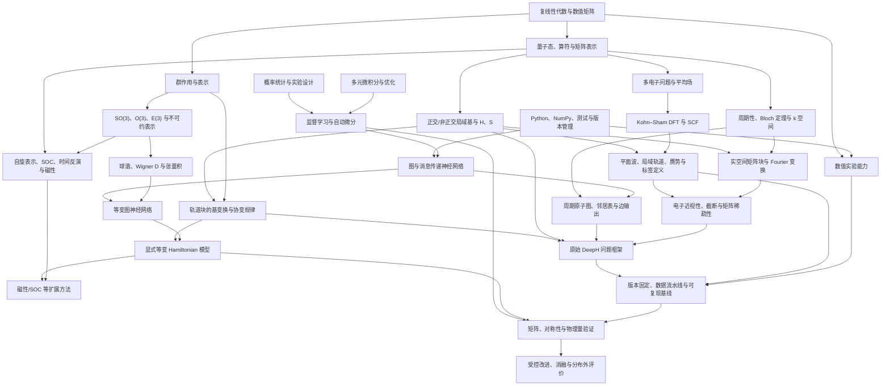

# DeepH 前置知识依赖图

## 读图规则

箭头 \(A\rightarrow B\) 表示：若要对模块 \(B\) 形成可推导、可验证的理解，模块 \(A\) 中列出的核心能力应当已经达到相应门槛。它不表示必须完整学完某一学科。学习顺序允许并行，但不能跳过进入后续模块所需的验收任务。

## 依赖模块与最低门槛

| 模块 | 最低应掌握内容 | 进入后续模块前的检验 |
|---|---|---|
| 复线性代数 | 内积、共轭转置、厄米矩阵、正定矩阵、谱分解、条件数、广义本征值问题 | 手算一个 \(2\times2\) 非正交基问题，并用 Cholesky 正交化验证本征值 |
| 量子力学表示 | 态、算符、基展开、矩阵元、期望值、简并与规范自由度 | 从 \(|\psi\rangle=\sum_\mu c_\mu|\phi_\mu\rangle\) 推导矩阵本征方程 |
| 周期体系 | 晶格、倒格、Bloch 条件、Brillouin 区、\(k\) 点 | 推导 \(H(\mathbf k)\) 的晶格 Fourier 和逆变换，并说明相位约定 |
| DFT 与数值电子结构 | Kohn–Sham 方程、SCF、泛函、赝势、基组与收敛 | 能将“模型误差”与“标签所继承的 DFT/基组误差”分别列出 |
| 监督学习 | 数据划分、损失、优化、过拟合、自动微分、分布外测试 | 在固定种子下训练小型回归器，并证明划分中没有重复样本泄漏 |
| 图神经网络 | 节点/边、消息、聚合、更新、边级输出、计算复杂度 | 从小型周期结构建立邻接表，实现一层 MPNN 并标注各张量形状 |
| 群表示 | 群作用、表示、不可约表示、不变量与等变量 | 给出标量、向量和二阶张量在旋转下的不同变换规律 |
| \(E(3)\) 等变网络 | 球谐、宇称、Wigner \(D\)、Clebsch–Gordan 张量积 | 对随机旋转执行数值等变测试，而非仅引用架构名称 |
| 软件与可复现性 | 环境、版本、配置、单元测试、数据校验、日志 | 从空环境按锁定清单复现实验，并生成相同量级的验证指标 |

## 三条主干及其汇合点

电子结构主干在“局域轨道中的 \(H\)、\(S\) 与周期 Fourier 变换”处汇合。缺少该主干时，模型输出只能被视作缺乏物理语义的矩阵数组，无法判断轨道排序、晶格平移、非正交性和基组变换是否正确。

机器学习主干在“周期原子图上的边级或原子对轨道块预测”处汇合。缺少该主干时，难以判断邻居截断、周期镜像、掩码和聚合规则是否造成标签错位或数据泄漏。

对称性主干在“轨道块的表示变换与等变网络输出”处汇合。哈密顿量矩阵元一般不是旋转标量；若只学习旋转不变特征而没有相容的输出变换规则，模型可能在训练构型上拟合良好，却在旋转后的同一物理结构上给出不一致结果。

## 可并行与不可跳过的部分

线性代数、Python 数值实验、基础量子力学可并行推进；监督学习也可与 DFT 基础并行。普通 MPNN 练习不必等待完整群论课程。相比之下，非正交基与周期 Fourier 变换不能晚于 DeepH 数据结构学习，普通图网络与群表示基础不能晚于显式等变网络学习，版本注册和数据校验不能晚于首次正式复现实验。

磁性、时间反演、自旋轨道耦合、杂化泛函、DFPT 和通用模型均属于后续分支。它们不构成简单无磁基线的前置条件，因而当前不纳入主干验收。

