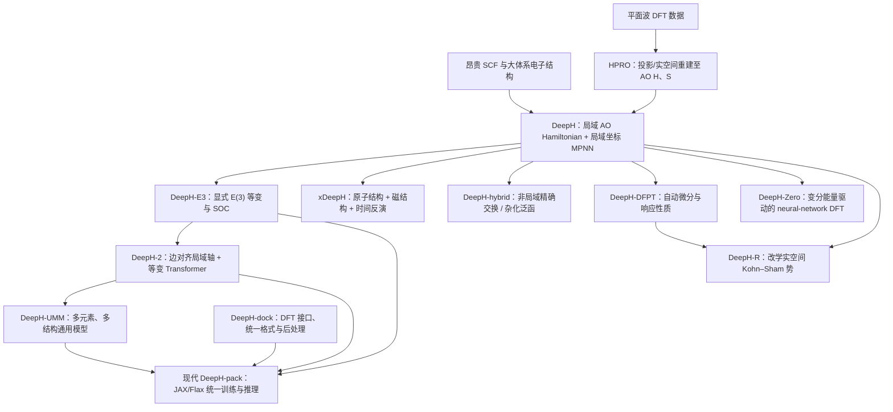

# DeepH 方法谱系与可审计文献地图

## 范围与证据边界

本地图核验日期为 **2026-08-03**。核心方法关系优先依据论文正文、补充材料、期刊页面、作者维护的代码仓库和官方软件文档。表中的“解决问题”和“主要贡献”只概括原始资料明确支持的内容；“主要限制”若是由公开实现状态或任务定义推得，将明确标为审计判断，不写成作者结论。

`DeepH-Zero` 是 DeepH 团队当前软件资料和机构说明使用的方法标签；其对应的同行评议论文题名是 *Neural-network Density Functional Theory Based on Variational Energy Minimization*，论文正文主要使用 “neural-network DFT” 和 `AI2DFT`。因此，本地图采用“DeepH-Zero / neural-network DFT”双名称，不假定二者是两个独立方法。

## 一、书目信息与软件可得性

| ID | 资料 | 类型与年份 | DOI / arXiv | 代码、数据或官方文档 | 核验状态 |
|---|---|---|---|---|---|
| DH-01 | [Deep-learning density functional theory Hamiltonian for efficient ab initio electronic-structure calculation](https://doi.org/10.1038/s43588-022-00265-6) | 同行评议论文，2022 | DOI `10.1038/s43588-022-00265-6`; arXiv `2104.03786` | [旧版 DeepH-pack](https://github.com/mzjb/DeepH-pack); 论文数据由仓库链接至 Zenodo | `PRIMARY_EXPLICIT` |
| DH-02 | [General framework for E(3)-equivariant neural network representation of density functional theory Hamiltonian](https://doi.org/10.1038/s41467-023-38468-8) | 同行评议论文，2023 | DOI `10.1038/s41467-023-38468-8`; arXiv `2210.13955` | [DeepH-E3](https://github.com/Xiaoxun-Gong/DeepH-E3); 仓库列出三组复现数据 | `PRIMARY_EXPLICIT` |
| DH-03 | [Deep-learning electronic-structure calculation of magnetic superstructures](https://doi.org/10.1038/s43588-023-00424-3) | 同行评议论文，2023 | DOI `10.1038/s43588-023-00424-3` | [xDeepH](https://github.com/mzjb/xDeepH); 数据 DOI `10.5281/zenodo.7561013` | `PRIMARY_EXPLICIT` |
| DH-04 | [Deep-Learning Density Functional Perturbation Theory](https://doi.org/10.1103/PhysRevLett.132.096401) | 同行评议论文，2024 | DOI `10.1103/PhysRevLett.132.096401`; arXiv `2401.17892` | 当前检索未定位到独立官方代码仓库 | 论文 `PRIMARY_EXPLICIT`; 代码 `UNVERIFIED` |
| DH-05 | [DeepH-2: Enhancing deep-learning electronic structure via an equivariant local-coordinate transformer](https://arxiv.org/abs/2401.17015) | 预印本，2024 | arXiv `2401.17015` | 当前检索未定位到独立公开仓库；现代 DeepH-pack 论文将其列为架构来源 | 论文 `PRIMARY_EXPLICIT`; 独立代码 `UNVERIFIED` |
| DH-06 | [A deep equivariant neural network approach for efficient hybrid density functional calculations](https://doi.org/10.1038/s41467-024-53028-4) | 同行评议论文，2024 | DOI `10.1038/s41467-024-53028-4`; arXiv `2302.08221` | [DeepH-hybrid 附加代码](https://github.com/aaaashanghai/DeepH-hybrid); 数据 Zenodo 页面说明文件受限 | `PRIMARY_EXPLICIT` |
| DH-07 | [Generalizing deep learning electronic structure calculation to the plane-wave basis](https://doi.org/10.1038/s43588-024-00701-9) | 同行评议论文，2024 | DOI `10.1038/s43588-024-00701-9` | [HPRO](https://github.com/Xiaoxun-Gong/HPRO); 数据 DOI `10.5281/zenodo.13377497` | `PRIMARY_EXPLICIT` |
| DH-08 | [Universal materials model of deep-learning density functional theory Hamiltonian](https://doi.org/10.1016/j.scib.2024.06.011) | 同行评议论文，2024 | DOI `10.1016/j.scib.2024.06.011`; arXiv `2406.10536` | 当前检索未定位到与论文一一对应的独立公开仓库或权重 | 论文 `PRIMARY_EXPLICIT`; 代码/权重 `UNVERIFIED` |
| DH-09 | [Neural-network Density Functional Theory Based on Variational Energy Minimization](https://doi.org/10.1103/PhysRevLett.133.076401) | 同行评议论文，2024 | DOI `10.1103/PhysRevLett.133.076401`; arXiv `2403.11287` | 论文介绍 `AI2DFT`; 当前检索未定位到公开代码仓库 | 方法 `PRIMARY_EXPLICIT`; “DeepH-Zero”标签由官方软件资料确认 |
| DH-10 | [Deep-Learning Density Functional Theory Hamiltonian in Real Space](https://doi.org/10.1103/mbhs-vlby) | 同行评议论文，2026 | DOI `10.1103/mbhs-vlby`; PRL 137, 046401; arXiv `2407.14379` | 截至核验日未在期刊页定位到代码链接 | 论文 `PRIMARY_EXPLICIT`; 代码 `UNVERIFIED` |
| SW-01 | [DeepH-pack: a general-purpose neural network package for deep-learning electronic structure calculations](https://doi.org/10.1038/s41524-026-02219-2) | 同行评议软件论文，2026 | DOI `10.1038/s41524-026-02219-2`; arXiv `2601.02938` | [官方文档](https://docs.deeph-pack.com/deeph-pack/en/latest/); PyPI `deepx-pack`; 软件获取页要求申请 | `PRIMARY_EXPLICIT` |
| SW-02 | [DeepH-dock](https://github.com/kYangLi/DeepH-dock) | 官方开源接口与后处理软件，2026 | 随 SW-01 引用 | [文档](https://docs.deeph-pack.com/deeph-dock/en/latest/); GPL-3.0 | `PRIMARY_EXPLICIT` |

### 第 1 章基础资料

| ID | 资料 | 固定版本与位置 | 本项目用途 |
|---|---|---|---|
| FND-01 | Richard M. Martin, *Electronic Structure: Basic Theory and Practical Methods* | Cambridge University Press, 2004；第 4、7、9、14、15 章 | 周期固体、Kohn–Sham、SCF、局域轨道与非正交性 |
| FND-02 | Gene H. Golub and Charles F. Van Loan, *Matrix Computations* | 4th ed., Johns Hopkins University Press, 2013；第 8.7 节，第 497—512 页 | 具有对称性的广义本征问题及数值求解背景 |
| FND-03 | M. Gu et al., [“Generalized Hermitian Eigenvalue Problems”](https://doi.org/10.1137/1.9780898719581.ch5) | SIAM, 2000；第 5 章，第 109—133 页 | 复数厄米定矩阵束、谱性质与算法边界 |
| FND-04 | Nicholas J. Higham, [“Applications”](https://doi.org/10.1137/1.9780898717778.ch2) | *Functions of Matrices*, SIAM, 2008；第 2 章，第 35—53 页，相关式见第 35 页 | 以 \(B^{-1/2}\) 或 Cholesky 分解把厄米定广义本征问题约化为标准问题 |
| FND-05 | Anne Greenbaum, Ren-Cang Li, and Michael L. Overton, [“First-Order Perturbation Theory for Eigenvalues and Eigenvectors”](https://doi.org/10.1137/19M124784X) | *SIAM Review* 62, 2020，第 463—482 页；Theorem 1 见第 465 页 | 简单特征值的一阶导数定理；广义 \(H/S\) 公式由该定理背景与 \(Hc=ESc\) 直接微分得到 |

FND-01—05 用于教材公式和概念的基础审计，不属于 DeepH 方法谱系，也不用于支持软件兼容性或性能结论。

## 二、DeepH 核心方法的技术地图

| ID | 解决的问题 | 输入 → 输出 | 基组或表示 | 对称性与网络架构 | 数据来源与适用体系 |
|---|---|---|---|---|---|
| DH-01 | 避免对新结构反复执行昂贵 SCF，同时处理哈密顿量维数与旋转协变 | 原子种类、坐标 → 局域轨道 DFT 哈密顿量块 | 局域原子轨道；非正交体系还需要重叠矩阵完成下游求解 | 局域性 + 局域坐标变换 + MPNN；将协变输出转到局域坐标中学习 | 论文中的石墨烯、MoS₂、双层/扭转范德华体系；标签来自固定 DFT 设置 |
| DH-02 | 消除局域坐标选择的负担，以显式等变网络统一轨道块变换并支持 SOC | 原子结构 → 自旋—轨道 DFT 哈密顿量 | 局域原子轨道的不可约表示分解 | `E(3)` 等变特征、球谐、Wigner–Eckart/张量积 | 非磁结构；论文包含有/无 SOC 示例；公开复现数据由官方仓库链接 |
| DH-03 | 使 Hamiltonian 显式依赖磁结构，处理非共线磁性与时间反演 | 原子结构 + 磁矩结构 → 自旋—轨道 DFT 哈密顿量 | 局域轨道与自旋空间 | `E(3)×{I,T}` 对称约束的深度等变网络 | 自旋螺旋、磁性纳米管、莫尔磁体与 skyrmion 场景 |
| DH-04 | 从机器学习 Hamiltonian 扩展到材料响应与电子—声子耦合 | 结构/扰动 → Hamiltonian、诱导势及其导数等 DFPT 量 | 局域基；包含 Pulay 相关修正与导数对象 | 等变网络 + 自动微分；并非仅对静态 Hamiltonian 做一次回归 | 论文示例研究电子—声子耦合及相关量；具体数据与代码可得性需继续核查 |
| DH-05 | 在局域坐标效率与严格等变表示之间折中，并引入 Transformer | 原子结构 → DFT Hamiltonian | 边方向定义局域 \(z\) 轴；局域坐标中的不可约特征 | equivariant local-coordinate transformer；预印本报告将张量积复杂度从 \(O(L^6)\) 降至 \(O(L^3)\) | 使用与早期工作相关的石墨烯、MoS₂ 数据比较；期刊审稿与独立代码状态未确认 |
| DH-06 | 学习含非局域精确交换的广义 KS / 杂化泛函 Hamiltonian | 原子结构 → 杂化泛函 Hamiltonian | 局域原子轨道；非局域交换导致更长程非零矩阵元 | 案例采用 DeepH-E3 等变网络，并增加适应非局域项的处理 | ABACUS/HSE06 数据；石墨烯、MoS₂ 与莫尔超胞；公开仓库只含相对 DeepH-E3 的附加代码 |
| DH-07 | 将平面波 DFT 结果可靠转换为 DeepH 可学习的 AO Hamiltonian | 平面波 DFT 波函数/势等 → 原子轨道 \(H,S\) | 平面波到选定 AO 表示的投影或实空间重建 | 这是表示转换算法，不是新 GNN；其误差由 AO 选择与重建精度约束 | 论文展示石墨烯与 MoS₂；当前 HPRO 包支持情况应按具体发布版本核验 |
| DH-08 | 从材料专用模型扩展到多元素、多结构的通用模型与微调 | 任意受支持材料结构 → DFT Hamiltonian | 论文采用统一的局域轨道标签体系 | 改进的 DeepH 等变/Transformer 架构；具体实现需结合全文与现代软件核对 | 大型材料数据库；元素覆盖、数据筛选与测试划分是评价通用性的关键边界 |
| DH-09 | 把 DFT 变分能量最小化与网络优化结合，减少对预生成监督标签的依赖 | 结构 → 网络 Hamiltonian → \(\rho,n,E[H]\) → 参数梯度 | 局域原子轨道 Hamiltonian；AI2DFT 为可微 DFT 实现 | DeepH-E3 + 可微变分 DFT + 反向传播；物理信息无监督学习 | 论文在 H₂O、石墨烯等示例上比较监督学习；不应把示例精度外推为任意材料保证 |
| DH-10 | 避免 AO 基依赖和复杂旋转协变目标，改学更基础的实空间量 | 原子结构 → 实空间 Kohn–Sham 势 → 目标基中的 Hamiltonian | 实空间势被论文描述为基组无关目标；Hamiltonian 仍需在所选表示中构造 | 预测旋转不变量的实空间势；论文称其具有更简化的等变规律与更强近视性 | 2026 年 PRL 论文；对 DeepH-DFPT 和电子结构基础模型的影响仍需按正文与补充材料逐项审计 |
| SW-01 | 统一此前分散的方法、训练/推理接口和工作流 | DeepH 格式数据 ↔ 训练/推理/物理后处理 | 现代 `DeepH` 数据布局，区别于 `DeepH-legacy` | JAX/Flax 实现的等变 GNN 框架；TOML 配置 | 支持晶体和分子工作流；软件获取与具体许可证/可修改性应在实践前确认 |
| SW-02 | 连接多种 DFT 输出、统一数据格式并提供后处理 | DFT 原始输出 ↔ DeepH 格式；预测矩阵 → 能带、波函数、密度等 | `POSCAR + info.json + overlap.h5 + hamiltonian.h5` 等 | 接口与数值后处理软件，不是训练模型 | 文档列出 OpenMX、SIESTA、ABACUS、FHI-aims、HONPAS 等；每个接口均有版本边界 |

## 三、主要贡献、限制与阅读顺序

| ID | 与前作关系及主要贡献 | 主要限制或证据边界 | 前置知识 | 建议顺序 |
|---|---|---|---|---|
| DH-01 | 建立 DeepH 的局域 Hamiltonian 学习问题、局域坐标方案和 MPNN 基线 | 标签依赖局域 AO 与 DFT 设置；局域坐标可能随邻居选择产生不连续；论文案例不能证明任意体系泛化 | 阶段 A—D，尤其非正交基、Bloch 与 MPNN | 1 |
| DH-02 | 用显式 `E(3)` 等变表示替代原始局域坐标处理，并扩展到 SOC | 张量积计算成本较高；实现使用较旧的 PyTorch/e3nn 版本 | 阶段 E | 2 |
| DH-03 | 在 DH-02 基础上加入磁结构、时间反演和自旋处理 | 只在需要磁性研究时进入；输入磁结构与标签生成显著增加复杂度 | 自旋、SOC、时间反演 | 6 |
| DH-05 | 结合边对齐局域轴、等变表示与 Transformer，针对 DH-01 平滑性和 DH-02 效率问题 | 截至核验日主要证据为预印本；独立公开代码未定位 | 完成 DH-01、DH-02 后 | 3 |
| DH-08 | 将体系专用模型扩展到通用材料模型并展示微调 | “通用”受元素、基组、训练数据库和划分覆盖限制；代码与权重状态待核实 | 数据覆盖、迁移学习、OOD 评价 | 4 |
| DH-09 | 将监督 Hamiltonian 回归改造成变分能量驱动的可微学习 | 论文发现零温总能量对未占据空间约束不足并加入广义泛函修正；这不是无需任何初始化或计算成本的普遍保证 | DFT 变分原理、密度矩阵、自动微分 | 7 |
| DH-06 | 验证 DeepH 框架可扩展到杂化泛函的非局域交换 | 需要更长程处理和昂贵训练标签；公开代码只是附加模块 | 广义 KS、杂化泛函 | 8 |
| DH-07 | 打通平面波 DFT 数据与 AO Hamiltonian 学习 | 输出仍依赖所选 AO 表示；具体后端支持不能由论文原则推断 | 平面波、赝势、AO 投影/重建 | 在确定平面波路线时阅读 |
| DH-04 | 通过自动微分扩展到 DFPT 与响应性质 | 响应量对导数、Pulay 项和数值平滑性更敏感；当前未核实独立代码 | DFPT、声子、电子—声子耦合 | 9 |
| DH-10 | 把学习目标由 AO Hamiltonian 改为实空间 KS 势，降低基与旋转处理负担 | 刚于 2026 年发表；代码和完整复现路径尚未核实，不应直接替代已有基线 | 实空间 DFT、势到矩阵的构造 | 在掌握 DH-01、DH-02、DH-07 后阅读 |
| SW-01/SW-02 | 统一现代训练、数据和后处理生态，并提供 legacy 转换 | 现代包不能与旧版命令、INI 或数据布局混用；软件获取方式需预先确认 | 完成理论与文献阶段后 | 实践前最后阅读 |

## 四、直接相关的对照方法

| ID | 资料 | 任务、表示与对称性 | 与 DeepH 的比较价值 | 代码/数据 |
|---|---|---|---|---|
| CMP-01 | [SchNOrb](https://doi.org/10.1038/s41467-019-12875-2), 2019 | 分子结构 → AO 基中的 Hamiltonian、重叠、轨道与能量；通过旋转数据增强学习旋转行为 | 早于 DeepH 的分子 AO 电子结构预测基线，可用于理解严格等变与数据增强的区别 | [SchNOrb](https://github.com/atomistic-machine-learning/SchNOrb) 与公开分子数据 |
| CMP-02 | [QHNet](https://proceedings.mlr.press/v202/yu23i.html), 2023 | `SE(3)` 等变分子 Hamiltonian 预测；架构重点是减少张量积与通道增长 | 适合比较轨道块输出与等变网络效率，但原始论文任务主要是分子基准，不等同于周期材料 DeepH | [AIRS](https://github.com/divelab/AIRS) |
| CMP-03 | [HamGNN](https://doi.org/10.1038/s41524-023-01130-4), 2023 | 分子与固体的 `E(3)` 等变 Hamiltonian；还给出含 SOC 的 `SU(2)`/时间反演参数化 | 与 DeepH-E3 在周期性、SOC、跨体系迁移和 Hamiltonian 参数化方面形成直接对照 | [HamGNN](https://github.com/QuantumLab-ZY/HamGNN); 数据与权重在 Zenodo |
| CMP-04 | [DeePTB](https://doi.org/10.1038/s41467-024-51006-4), 2024 | 从结构与本征值标签学习简化、正交、有限程 TB Hamiltonian，可处理超大体系 | 其目标是重现实用低能带结构，不是逐元素复现固定 AO KS Hamiltonian；适合比较标签选择、基依赖和可扩展性 | [DeePTB](https://github.com/deepmodeling/DeePTB) |
| CMP-05 | [Uni-HamGNN](https://doi.org/10.1038/s42256-026-01196-x), 2026 | 通用 SOC Hamiltonian；将自旋无关项与 SOC 修正分解并进行 delta learning | 为 DeepH-E3/xDeepH/UMM 的 SOC 通用性提供最新外部对照；不能仅用平均矩阵误差比较 | [公开模型权重与筛选结构](https://doi.org/10.5281/zenodo.17239078); 当前未核实代码仓库 |

## 五、问题演化树

图中的实线表示原始论文或官方软件资料明确支持的问题继承关系。DeepH-R 论文明确将实空间势方法与早期 Hamiltonian 学习和 DFPT 联系起来；但“现代 DeepH-pack 已实现 DeepH-R”目前没有被已核验资料支持，因此图中不画 `R → PACK`。

## 六、建议阅读路径

先读 DH-01 的问题定义、局域性、矩阵标签和验证，再读 DH-02 的表示分解与等变输出；随后用 DH-05 比较局域坐标与显式等变方法的效率—平滑性取舍。理解主干后再读 DH-08 与 SW-01，避免把“通用模型”与“统一软件包”混为同一概念。

分支按研究问题选择：磁性读 DH-03；杂化泛函读 DH-06；平面波数据读 DH-07；响应与电子—声子耦合读 DH-04；变分无监督优化读 DH-09；实空间势与基组无关学习目标读 DH-10。CMP-01—05 用于建立外部基线，不宜在尚未统一标签、基组和数据划分时直接比较数值 MAE。
